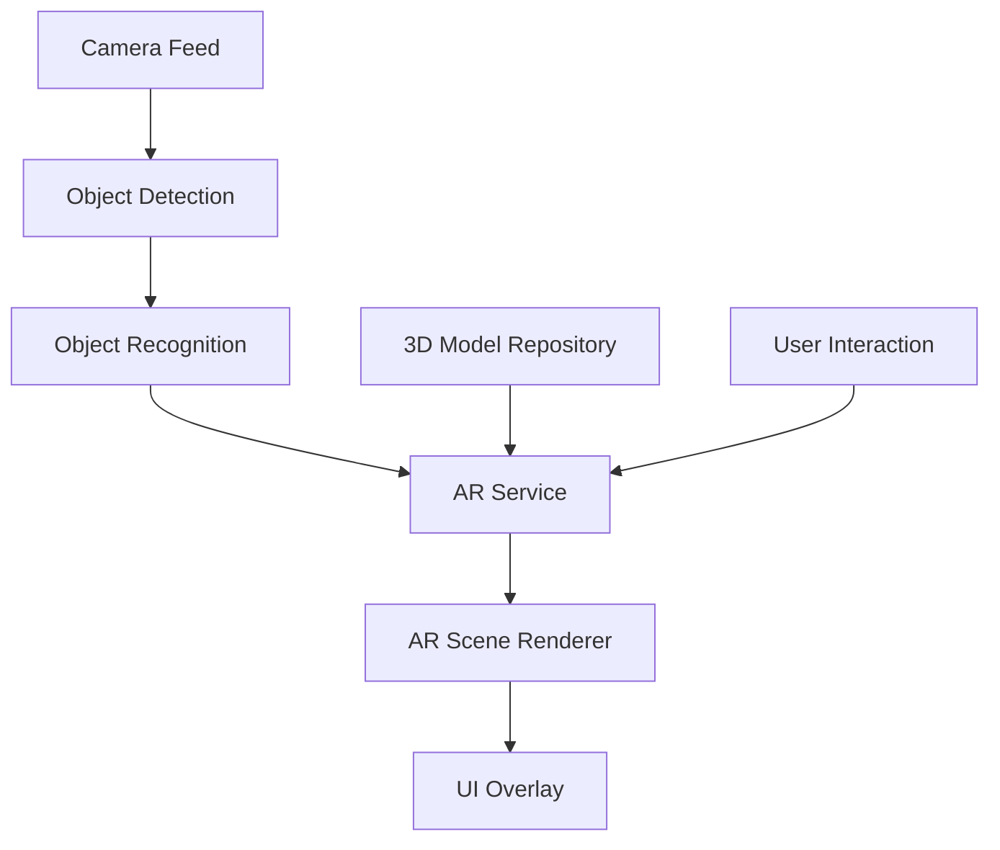

# Design Document: AR 3D Rendering Feature

## Overview

The AR 3D Rendering feature will enhance the Kids Tutor app by integrating augmented reality capabilities that display interactive 3D models corresponding to detected objects. This document outlines the technical design and implementation approach for adding this feature to the existing application.

The feature will build upon the current object detection functionality in the explore page, adding AR rendering capabilities that will display 3D models in real-time when objects are detected through the camera. The implementation will focus on performance, usability, and educational value.

## Architecture

### High-Level Architecture

The AR 3D Rendering feature will be implemented using a layered architecture:

1. **Presentation Layer**: UI components for AR visualization and user interaction
2. **AR Service Layer**: Core AR functionality including rendering, tracking, and scene management
3. **Model Management Layer**: 3D model loading, caching, and optimization
4. **Integration Layer**: Connection between object detection and AR rendering



### AR Integration Strategy

We will use the `ar_flutter_plugin` package, which provides a Flutter-friendly wrapper around ARCore (Android) and ARKit (iOS). This plugin offers:

1. Plane detection and tracking
2. Anchor management
3. 3D object rendering
4. Light estimation
5. Hit testing for user interaction

The AR functionality will be integrated into the existing `ExplorePage` widget, extending it to include AR capabilities while maintaining the current object detection features.

## Components and Interfaces

### 1. AR Manager

The `ARManager` class will be the central component responsible for initializing and managing the AR session:

```dart
class ARManager {
  // Singleton instance
  static final ARManager _instance = ARManager._internal();
  factory ARManager() => _instance;
  ARManager._internal();
  
  // AR session controller
  ARSessionController? _arSessionController;
  
  // AR availability
  bool _isARSupported = false;
  bool get isARSupported => _isARSupported;
  
  // Initialize AR
  Future<bool> initialize() async {
    // Check AR availability
    // Initialize AR session
    // Return success/failure
  }
  
  // Create AR session
  Future<ARSessionController> createARSession(BuildContext context) async {
    // Create and configure AR session
    // Return session controller
  }
  
  // Dispose resources
  void dispose() {
    // Clean up resources
  }
}
```

### 2. 3D Model Manager

The `ModelManager` class will handle loading, caching, and providing 3D models:

```dart
class ModelManager {
  // Singleton instance
  static final ModelManager _instance = ModelManager._internal();
  factory ModelManager() => _instance;
  ModelManager._internal();
  
  // Model cache
  final Map<String, ARNode> _modelCache = {};
  
  // Load a model by name
  Future<ARNode> loadModel(String modelName) async {
    // Check cache first
    // If not in cache, load from assets
    // Add to cache
    // Return model node
  }
  
  // Preload common models
  Future<void> preloadCommonModels() async {
    // Preload frequently used models
  }
  
  // Clear cache
  void clearCache() {
    _modelCache.clear();
  }
}
```

### 3. AR View Widget

The `ARView` widget will render the AR scene and handle user interactions:

```dart
class ARView extends StatefulWidget {
  final List<Map<String, dynamic>> recognitions;
  final Function(String) onModelInteraction;
  
  const ARView({
    Key? key,
    required this.recognitions,
    required this.onModelInteraction,
  }) : super(key: key);
  
  @override
  _ARViewState createState() => _ARViewState();
}

class _ARViewState extends State<ARView> {
  // AR session controller
  ARSessionController? _arSessionController;
  
  // Active nodes
  final Map<String, ARNode> _activeNodes = {};
  
  @override
  void initState() {
    super.initState();
    _initializeAR();
  }
  
  Future<void> _initializeAR() async {
    // Initialize AR session
    // Configure AR view
  }
  
  @override
  void didUpdateWidget(ARView oldWidget) {
    super.didUpdateWidget(oldWidget);
    // Update AR scene based on new recognitions
    _updateARScene();
  }
  
  void _updateARScene() {
    // Process recognitions
    // Add/remove/update 3D models in the scene
  }
  
  @override
  Widget build(BuildContext context) {
    // Build AR view widget
  }
  
  @override
  void dispose() {
    // Clean up resources
    super.dispose();
  }
}
```

### 4. Settings Service

The `SettingsService` class will manage user preferences for AR features:

```dart
class SettingsService {
  // Singleton instance
  static final SettingsService _instance = SettingsService._internal();
  factory SettingsService() => _instance;
  SettingsService._internal();
  
  // Shared preferences instance
  late SharedPreferences _prefs;
  
  // Initialize
  Future<void> initialize() async {
    _prefs = await SharedPreferences.getInstance();
  }
  
  // AR enabled getter/setter
  bool get isAREnabled => _prefs.getBool('ar_enabled') ?? true;
  
  Future<void> setAREnabled(bool value) async {
    await _prefs.setBool('ar_enabled', value);
  }
}
```

## Data Models

### 1. AR Model

The `ARModel` class will represent a 3D model with its metadata:

```dart
class ARModel {
  final String id;
  final String name;
  final String modelPath;
  final double scale;
  final Vector3 rotation;
  final Map<String, dynamic> metadata;
  
  const ARModel({
    required this.id,
    required this.name,
    required this.modelPath,
    this.scale = 1.0,
    this.rotation = const Vector3(0, 0, 0),
    this.metadata = const {},
  });
}
```

### 2. AR Model Mapping

We'll create a mapping between detected objects and their corresponding 3D models:

```dart
class ARModelMapping {
  // Singleton instance
  static final ARModelMapping _instance = ARModelMapping._internal();
  factory ARModelMapping() => _instance;
  ARModelMapping._internal();
  
  // Model mappings
  final Map<String, ARModel> _mappings = {
    'A': ARModel(
      id: 'apple',
      name: 'Apple',
      modelPath: 'assets/3d_models/apple.glb',
      scale: 0.2,
    ),
    'B': ARModel(
      id: 'ball',
      name: 'Ball',
      modelPath: 'assets/3d_models/ball.glb',
      scale: 0.15,
    ),
    // Additional mappings...
  };
  
  // Get model by letter
  ARModel? getModelForLetter(String letter) {
    return _mappings[letter];
  }
}
```

## Error Handling

### 1. AR Availability Checking

Before attempting to use AR features, the app will check if AR is supported on the device:

```dart
Future<bool> checkARAvailability() async {
  try {
    final bool isARAvailable = await ArCoreController.checkArCoreAvailability();
    return isARAvailable;
  } catch (e) {
    debugPrint('Error checking AR availability: $e');
    return false;
  }
}
```

### 2. Graceful Degradation

If AR is not supported or encounters issues, the app will fall back to the current 2D display:

```dart
Widget _buildAROrFallback() {
  return FutureBuilder<bool>(
    future: ARManager().initialize(),
    builder: (context, snapshot) {
      if (snapshot.connectionState == ConnectionState.waiting) {
        return const Center(child: CircularProgressIndicator());
      }
      
      final bool isARAvailable = snapshot.data ?? false;
      
      if (isARAvailable && SettingsService().isAREnabled) {
        return ARView(
          recognitions: _recognitions,
          onModelInteraction: _handleModelInteraction,
        );
      } else {
        // Fall back to current 2D display
        return _buildRecognitionResults();
      }
    },
  );
}
```

### 3. Error Reporting

The app will include error reporting for AR-related issues:

```dart
void _reportARError(String message, dynamic error) {
  debugPrint('AR Error: $message - $error');
  
  // Show user-friendly error message if appropriate
  if (_shouldShowErrorToUser(error)) {
    ScaffoldMessenger.of(context).showSnackBar(
      SnackBar(
        content: Text('AR feature encountered an issue. Falling back to standard view.'),
        behavior: SnackBarBehavior.floating,
      ),
    );
  }
}
```

## Testing Strategy

### 1. Unit Testing

Unit tests will be written for:
- Model loading and caching
- AR availability checking
- Settings management
- Model mapping logic

### 2. Integration Testing

Integration tests will verify:
- Proper integration between object detection and AR rendering
- Correct handling of AR session lifecycle
- Appropriate fallback behavior when AR is unavailable

### 3. Performance Testing

Performance tests will ensure:
- Acceptable frame rates during AR rendering
- Efficient memory usage
- Battery consumption within reasonable limits

### 4. User Testing

User testing will focus on:
- Ease of understanding the AR interface
- Responsiveness of 3D model interactions
- Educational value of the AR experience

## Implementation Considerations

### 1. 3D Model Format and Optimization

We will use the glTF/GLB format for 3D models due to its efficiency and wide support. Models will be optimized for mobile devices by:
- Keeping polygon counts under 10,000 per model
- Using compressed textures
- Implementing level-of-detail (LOD) for complex models
- Limiting texture sizes to 1024x1024 or smaller

### 2. Performance Optimization

To ensure smooth performance:
- Models will be pre-loaded and cached when possible
- Only one high-quality model will be rendered at a time
- Background processing will be minimized during AR sessions
- Inactive models will be removed from the scene

### 3. Cross-Platform Compatibility

The implementation will account for differences between ARCore (Android) and ARKit (iOS):
- Using platform-specific configurations when necessary
- Implementing feature detection to handle capability differences
- Providing appropriate fallbacks for unsupported features

### 4. User Experience Considerations

The AR experience will be designed with children in mind:
- Simple, intuitive interactions
- Clear visual feedback
- Forgiving hit testing for small fingers
- Educational content integrated with the AR experience